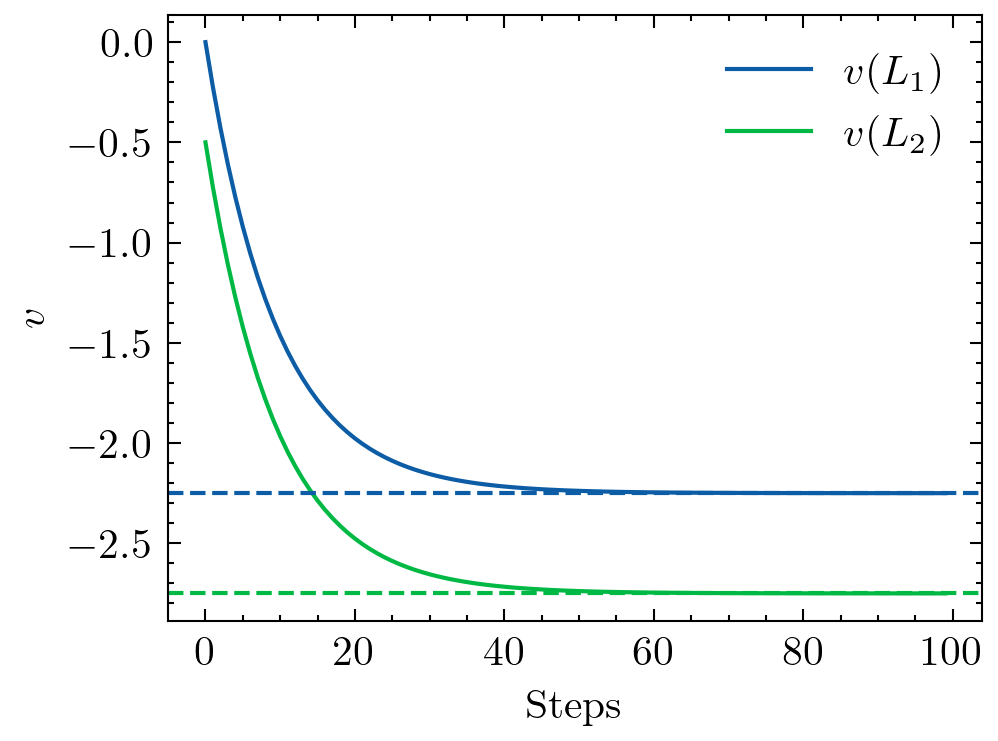

# ゼロから作るDeepLearning4 強化学習編編 4章 動的計画法

## 動的計画法と方策評価

強化学習では、主に**方策評価**(Policy Evaluation)もしくは**方策制御**(Policy Control)の2つ(?)タスクに取り組む。

- 方策評価 -> ある方策$\pi$が与えられた場合の価値関数$v_{\pi}(s)$, $q_{\pi}(s,a)$を求める。

- 方策制御 -> 方策を制御することで最適方策へと調整すること。

強化学習のゴールは、方策制御であるが最適方策を直接得ることが困難であるため、方策評価を初めに行う事が多いらしい。

なにかしらの方策$\pi$を用意し方策評価を行うことで価値関数を求め、それをもとに方策を制御する感じ?

### 動的計画法の概要

ベルマン方程式(3.1.2参照)を用いると状態価値関数$v_{\pi}(s)$は、
$$
v_{\pi}(s) = \sum_{a,s'}\pi(a|s)p(s'|s,a)\{r(s,a,s')+\gamma v_{\pi}(s')\}
$$
で記述される。

しかし、これを直接解くことが困難な場合が多いため動的計画法では、上式を
$$
V_{k+1}(s) = \sum_{a, s'}\pi(a|s)p(s'|s,a)\{r(s,a,s')+\gamma V_{k}(s')\}
$$
を用いてベルマン方程式を価値関数の更新式へ変形する。

ここで、$V$はあくまで**推定値**であるため、真の状態価値関数$v$とは異なることに注意。

### 反復方策評価を試す
3章と同様の2マスのグリッドワールドを例として方策評価を行う例を示す。
この時、状態遷移は決定論的であることから、先ほど求めた更新式は、
$$
V_{k+1}(s) = \sum_{a}\pi(a|s)\{r(s,a,s')+\gamma V_{k}(s')\}
$$
で表される。

そして、ステップ0(初期値)をそれぞれ、

$$V_0(L_1) = 0$$
$$V_0(L_2) = 0$$
とする。

更新式を展開すると、$L_1$, $L_2$それぞれに対して、
$$
\begin{aligned}
V_{k+1}(L_1) = & \pi(a_r|L_1)\{r(L_1,a_r,L_2)+\gamma V_{k}(L_2)\} \\
               &+ \pi(a_l|L_1)\{r(L_1,a_l,L_1)+\gamma V_{k}(L_1)\}
\end{aligned}
$$

$$
\begin{aligned}
V_{k+1}(L_2) =& \pi(a_r|L_2)\{r(L_2,a_r,L_2)+\gamma V_{k}(L_2)\} \\
              &+ \pi(a_l|L_2)\{r(L_2,a_l,L_1)+\gamma V_{k}(L_1)\}
\end{aligned}
$$
で表される。ここで、$a_r$は右へ行動、$a_l$は左への行動を示す。

上記の式を用いて100ステップ更新した結果を下記に示す。
どちらも、およそ-2.25, -2.75に収束していることが確認できる。

